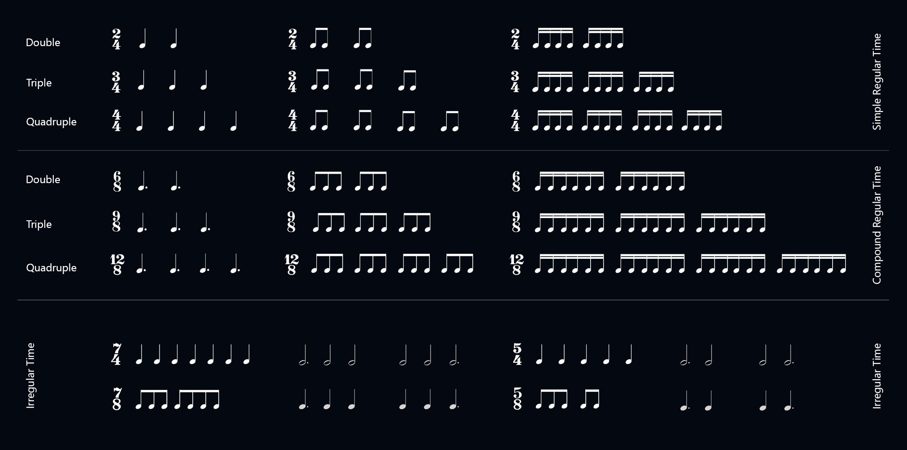

# Web Metronome
The **Metronome** is an interactive web application designed for musicians and music students. This tool allows you to adjust the tempo, volume, and subdivision of beats, generating precise click sounds using the **Web Audio API**.

# Popular Beats and Time Signatures.
**Binaries, Ternaries, and cuaternarias.**

## Key Features
- **BPM (Beats Per Minute) Adjustment:** Allows you to control the metronome's tempo within a configurable range.
- **Volume Control:** Offers a slider to adjust the volume of the clicks.
- **Beat Subdivision:** Lets you select the accent on the first beat of each subdivision.
- **Custom Click Sound:** Uses a square wave to generate a dry and precise click sound.
- **Start and Stop:** Includes a "Play/Stop" button for easy control of the metronome.

## Usage Instructions
1. Adjust the BPM using the slider to set the desired tempo.
2. Regulate the click volume using the corresponding slider.
3. Select the beat subdivision from the dropdown menu.
4. Start or stop the metronome using the **"Play/Stop"** button.

## Technologies Used
- **HTML:** Structure of the user interface.
- **CSS:** Styles for a clean and responsive interface.
- **JavaScript:** Application logic and event handling.
- **Web Audio API:** Generation of click sounds and audio control.
